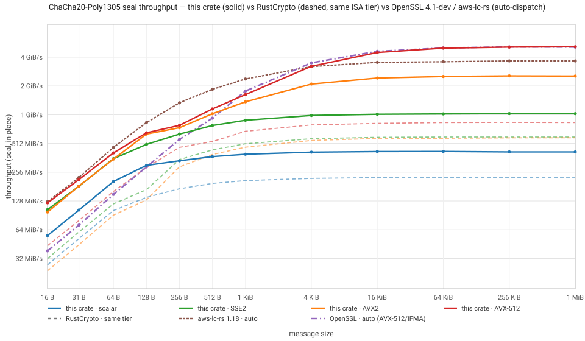
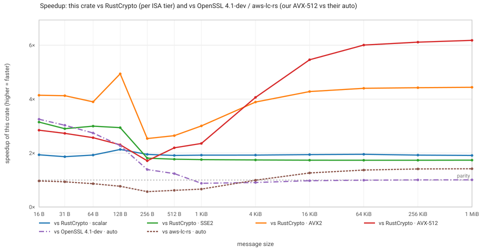

# chacha20poly1305-simd

Pure Rust implementation of [ChaCha20-Poly1305](https://tools.ietf.org/html/rfc8439) (RFC 8439) and XChaCha20-Poly1305 AEAD, with hand-written SIMD for x86_64 / aarch64:

- AVX-512 / AVX2 / SSE2 / NEON / scalar backends, runtime-detected (AVX-512 is default-on and can be disabled)
- `no_std` compatible, optional `zeroize`

> [!NOTE]
> Disclaimer: this project was developed with AI assistance and has not undergone a security audit

## Usage

```rust
use chacha20poly1305_simd::{ChaCha20Poly1305, Key, Nonce, Tag};

let key = [0x42u8; 32];
let nonce = [7u8; 12];
let cipher = ChaCha20Poly1305::new(&key);

let mut buffer = *b"hello world";
let tag: Tag = cipher.encrypt_in_place_detached(&nonce, b"aad", &mut buffer);
assert_ne!(&buffer, b"hello world");

cipher
    .decrypt_in_place_detached(&nonce, b"aad", &mut buffer, &tag)
    .unwrap();
assert_eq!(&buffer, b"hello world");
```

Allocating variants append / verify a 16-byte tag at the end of the ciphertext, matching the upstream wire format. AAD is optional:

```rust
use chacha20poly1305_simd::{Payload, XChaCha20Poly1305, XNonce};

let cipher = XChaCha20Poly1305::new(&[1u8; 32]);
let nonce = [2u8; 24];
let ct = cipher.encrypt(&nonce, b"secret payload").unwrap();
assert_eq!(ct.len(), b"secret payload".len() + 16);
assert_eq!(cipher.decrypt(&nonce, &ct).unwrap(), b"secret payload");

let ct = cipher
    .encrypt(&nonce, Payload { msg: b"secret payload", aad: b"header" })
    .unwrap();
assert_eq!(
    cipher.decrypt(&nonce, Payload { msg: &ct, aad: b"header" }).unwrap(),
    b"secret payload"
);
```

Keys and nonces can be generated from the OS CSPRNG with the `getrandom` feature (default on):

```rust
use chacha20poly1305_simd::{ChaCha20Poly1305, Generate, Key, Nonce};

let cipher = ChaCha20Poly1305::new(&Key::generate());
let nonce = Nonce::generate();
```

## Features

| feature     | default | description                                        |
| ----------- | ------- | -------------------------------------------------- |
| `avx512`    | ✓       | x86-64 AVX-512 backend                             |
| `std`       | ✓       | runtime CPU detection (otherwise scalar backend)   |
| `alloc`     | ✓       | allocating API                                     |
| `getrandom` | ✓       | `Key`/`Nonce` random generation via `Generate`     |
| `zeroize`   | –       | zeroize keys and intermediate secrets on drop      |
| `hotpath`   | –       | [hotpath](https://crates.io/crates/hotpath) probes |

## Backend selection

Runtime detection is the default (x86-64: avx512 (feature needed) → avx2 → sse2; aarch64: neon). A backend can also be forced at compile time via RUSTFLAGS (forcing a SIMD backend is a promise that the target CPU supports that instruction set; other backend kernels are no longer compiled into the binary):

```sh
RUSTFLAGS='--cfg chacha20poly1305_backend="avx2" -Ctarget-feature=+avx2' cargo build --release
```

| backend  | target  | required target features   |
| -------- | ------- | -------------------------- |
| `soft`   | any     | –                          |
| `sse2`   | x86-64  | – (baseline ISA)           |
| `avx2`   | x86-64  | `+avx2`                    |
| `avx512` | x86-64  | `+avx2,+avx512f,+avx512vl` |
| `neon`   | aarch64 | – (baseline ISA)           |

## Performance

> Test environment: AMD Ryzen 9 7950X (Zen 4) · Linux · rustc 1.100-nightly  
> Workload: AEAD **seal** (`encrypt_in_place_detached`, 16-byte AAD, in-place), throughput = msg / wall time.  
> Contenders: RustCrypto `chacha20poly1305` 0.11 (`cargo bench --bench aead`, same ISA tier) and OpenSSL 4.1.0-dev (static build, `EVP_chacha20_poly1305`, runtime auto-dispatch — on this CPU: AVX-512 ChaCha + AVX-512 IFMA Poly1305; bench driver: [`perf/openssl_bench.c`](perf/openssl_bench.c)).





Highlights:

|                     | vs RustCrypto (same ISA tier) | vs OpenSSL 4.1-dev (auto)                 |
| ------------------- | ----------------------------- | ----------------------------------------- |
| tiny (16–256 B)     | 1.7–4.9×                      | 1.4–3.2× faster (fused prologue pays off) |
| mid (512 B – 1 KiB) | 1.8–3.0×                      | ~parity (0.9–1.25×)                       |
| large (≥ 4 KiB)     | 1.7–6.2× (AVX2 64 KiB: 4.4×)  | parity (1 MiB: 5.15 vs 5.11 GiB/s)        |

### AArch64

> Measured under QEMU TCG emulation; the ratios roughly reflect the difference in instructions-per-byte / computational efficiency:

| message              | 64 B    | 256 B   | 1 KiB   | 4 KiB    | 64 KiB   | 1 MiB    |
| :------------------- | :------ | :------ | :------ | :------- | :------- | :------- |
| this impl throughput | 38 MB/s | 46 MB/s | 89 MB/s | 105 MB/s | 100 MB/s | 112 MB/s |
| speedup              | 8.9×    | 9.3×    | 3.6×    | 3.4×     | 2.9×     | 2.0×     |

On aarch64, RustCrypto only enables NEON for ChaCha; Poly1305 remains a scalar soft implementation.

## Verification

- RFC 8439 and XChaCha official test vectors (`cargo test`)
- Differential fuzzing against the RustCrypto implementation (`fuzz/run.sh`), asserting byte-exact ciphertext/tag equality and identical open verdicts. On x86_64 (soft/sse2/avx2/avx512 in parallel, 40 min per backend): 226 million executions in the latest run (soft 45.9M / sse2 48.9M / avx2 68.0M / avx512 63.5M), cumulative > 430 million executions, 0 crashes.
- aarch64 cross-validation under QEMU user mode: randomized differential testing via `cargo run --release --example xcheck -- [iterations] [seed]`; the NEON backend passed 500 thousand differential cases under QEMU

## License

MIT OR Apache-2.0
